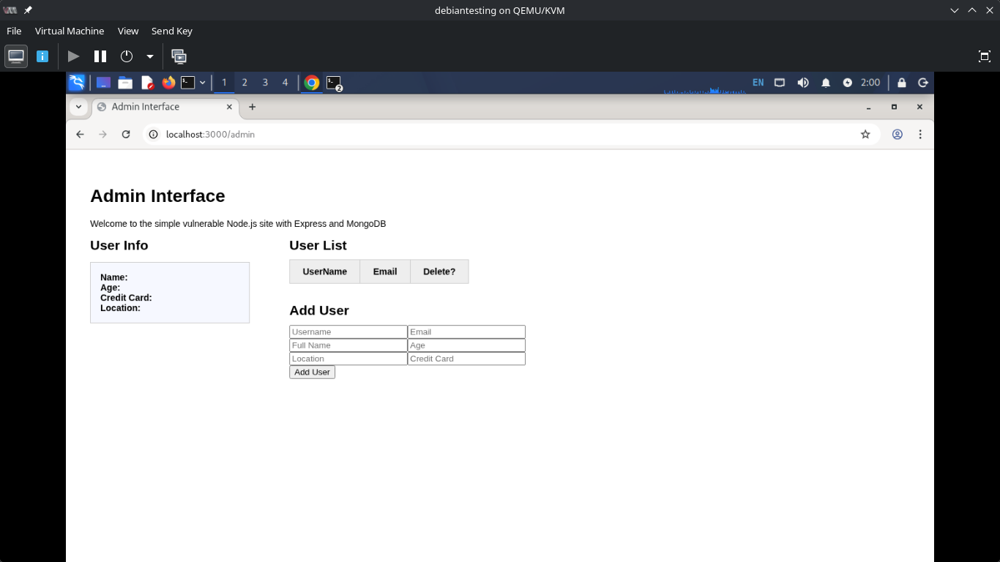
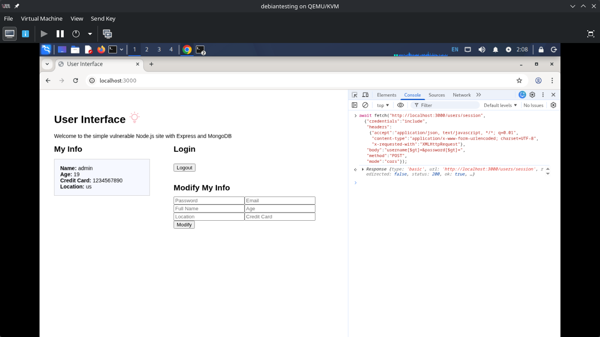
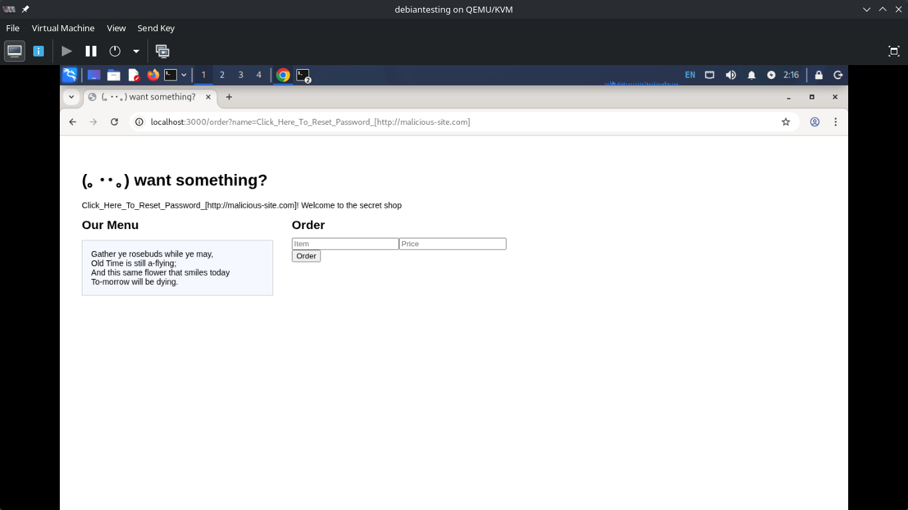
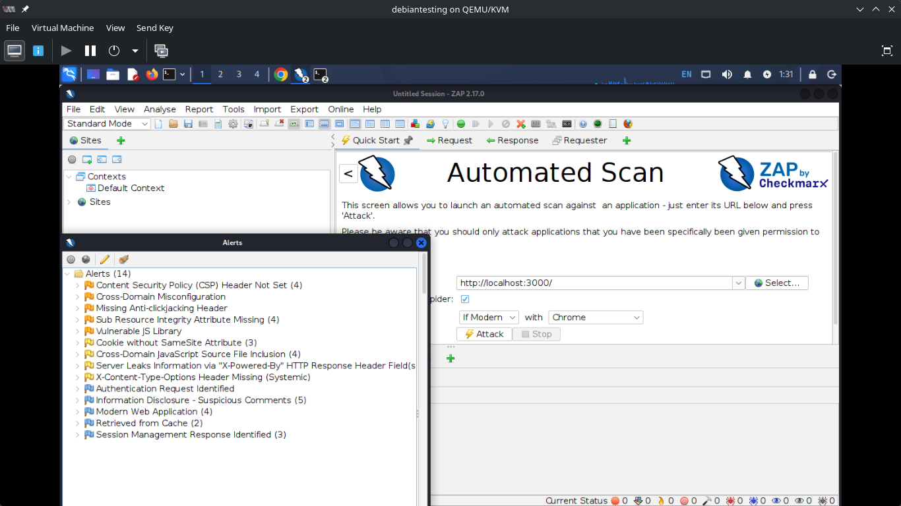
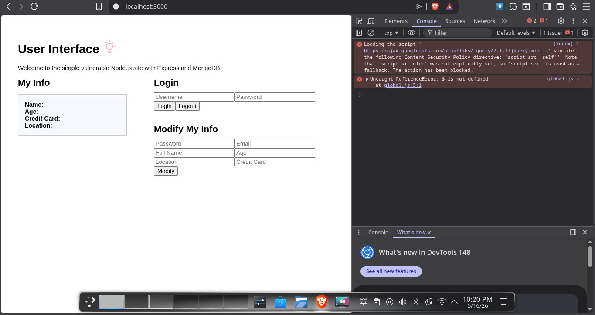
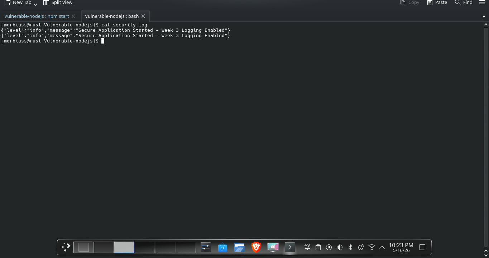
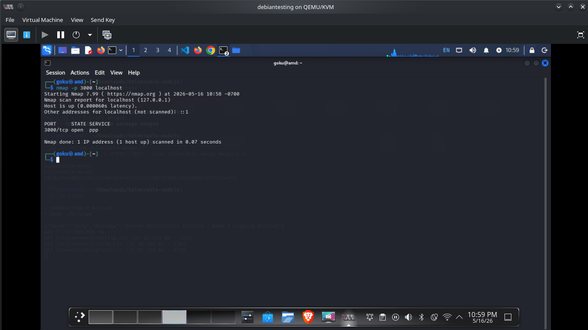
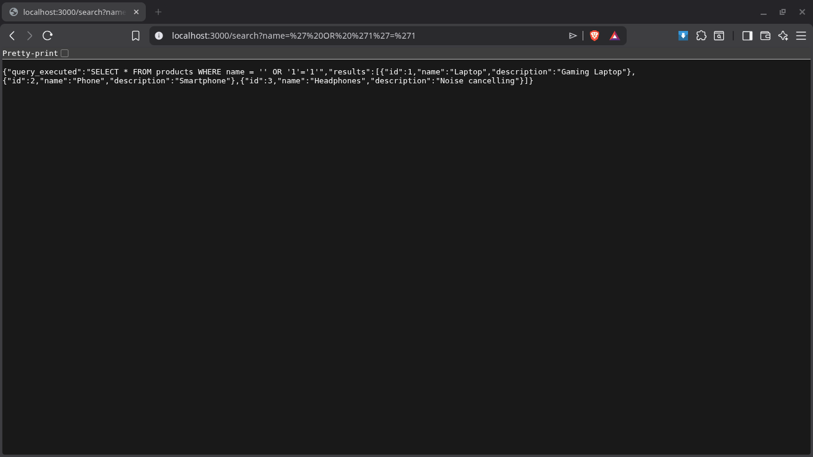
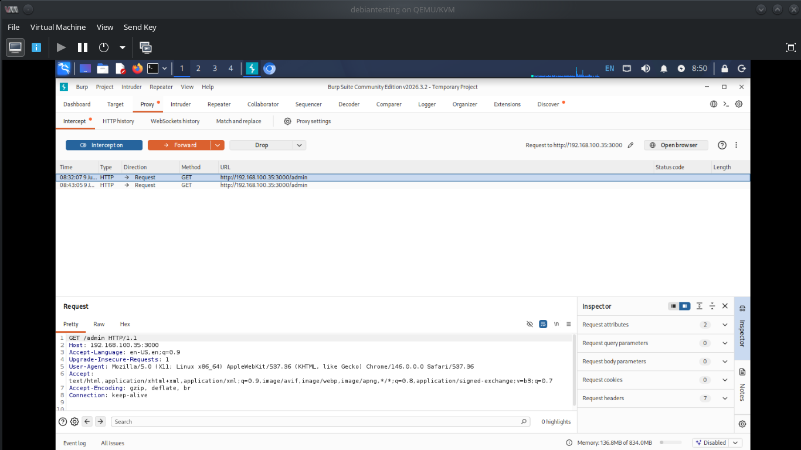
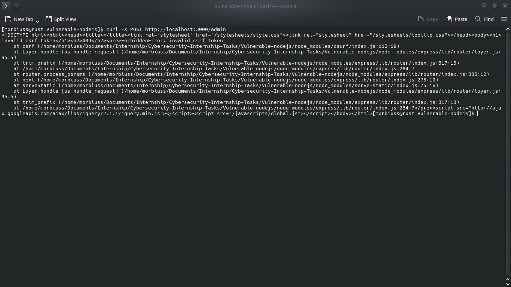

# 🛡️ Cybersecurity Internship: Week 1 Security Assessment

> **Student:** Abdul Hadi
> **ID:** DHC-418
> **Institute:** Khwaja Fareed University of Engineering and Information Technology
> **Internship:** DevelopersHub corporation Cybersecurity Internship 2026
> **Deadline:** 15th May, 2026

---

## 📝 1. Assessment Overview
During Week 1, I successfully set up the mock vulnerable web application locally on my Kali Linux environment. My objective was to evaluate the application's security posture by combining automated scanning (OWASP ZAP) with manual penetration testing techniques (Browser Developer Tools). 

Since the application uses MongoDB instead of a traditional relational database, I had to adapt my testing methodology—shifting from standard SQL Injection techniques to NoSQL injection vectors.

---

## 🔎 2. Vulnerability Findings & Proof of Concept

### Finding 1: Broken Access Control (Admin Panel Bypass)
* **Risk Level:** High
* **Observation:** While exploring the application routes, I discovered that the `/admin` endpoint lacks proper session validation. 
* **Exploitation:** By simply navigating to `http://localhost:3000/admin` as an unauthenticated user, I was granted full access to the administrative interface, including the ability to view the User List and add new users.
* **Evidence:**
  

### Finding 2: Authentication Bypass via NoSQL Injection
* **Risk Level:** Critical
* **Observation:** The assignment required testing for weak password storage and SQL injection (e.g., `' OR '1'='1`). However, upon identifying the backend as MongoDB, I realized standard SQL payloads wouldn't work.
* **Exploitation:** I inspected the login mechanism and crafted a NoSQL injection payload using the `$gt` (greater than) operator. By injecting `username[$gt]=&password[$gt]=` via the browser console's Fetch API, I manipulated the database query to evaluate as true. This successfully bypassed the login screen and exposed the admin's sensitive information (Credit Card, Location, etc.) without requiring a password.
* **Evidence:**
   

### Finding 3: Reflected Text Injection (Content Spoofing)
* **Risk Level:** Medium
* **Observation:** I tested the application for Cross-Site Scripting (XSS) using standard payloads like ``. The templating engine successfully escaped the HTML tags. However, it failed to sanitize the input structure.
* **Exploitation:** The `/order` route blindly reflects the `name` query parameter into the DOM. I was able to inject misleading text/links (e.g., `?name=Click_Here_To_Reset_Password_[http://malicious-site.com]`), which could easily be used in a social engineering or phishing attack against users.
* **Evidence:**
   

### Finding 4: Security Misconfigurations & Weak Headers (OWASP ZAP)
* **Risk Level:** Medium to Low
* **Observation:** To ensure I didn't miss any infrastructural flaws, I ran an automated scan using OWASP ZAP against the local server.
* **Automated Findings:** 
  1. **Vulnerable JS Library:** The app uses an outdated jQuery version (v2.1.1) which is vulnerable to known CVEs.
  2. **Missing CSP:** No Content Security Policy is defined, increasing the risk of data injection.
  3. **Missing Clickjacking Protection:** The `X-Frame-Options` header is absent.
  4. **Cookie Misconfiguration:** Session cookies lack the `SameSite` attribute, opening the door for CSRF attacks.
* **Evidence:**
   

---

## 🛠️ 3. Areas of Improvement & Remediation Plan

Based on my manual and automated testing, here is what needs to be fixed in the upcoming weeks:

1. **Secure the Admin Route:** Implement strict session validation and JWT (JSON Web Tokens) to ensure only authenticated administrators can access the `/admin` dashboard.
2. **Sanitize Database Inputs:** Use libraries like `validator` to ensure inputs are strictly strings and strip out NoSQL operators (like `$gt`, `$ne`) before passing them to MongoDB.
3. **Enforce Strong Password Policies:** Implement `bcrypt` to securely hash passwords. The current system appears to store or handle passwords insecurely.
4. **Implement Security Headers:** Integrate `helmet.js` in the Express app to automatically set crucial HTTP headers, including `Content-Security-Policy`, `X-Frame-Options: DENY`, and `X-Content-Type-Options: nosniff`.
5. **Secure Session Cookies:** Update the cookie configuration to include the `SameSite=Lax` or `Strict` attribute.

---

## 🛡️ Week 2: Implementing Security Measures & Remediation

**Status:** Completed
**Objective:** Patch the vulnerabilities discovered in Week 1 using industry-standard Node.js security libraries.

### 1. Fixing Authentication Bypass (NoSQL Injection)
* **Vulnerability:** The application previously accepted NoSQL operators (like `$gt`) directly from the login form, allowing attackers to bypass authentication.
* **Fix Applied:** * Implemented strict type checking in `routes/users.js` to ensure `req.body.username` and `req.body.password` are processed strictly as strings (`typeof === 'string'`).
  * Modified the database query logic to explicitly search by string values, completely neutralizing object-based NoSQL injection payloads.

### 2. Secure Password Storage
* **Vulnerability:** Passwords were being stored in plain text, exposing user credentials in the event of a database breach.
* **Fix Applied:** * Integrated the `bcrypt` library.
  * Implemented password hashing in the `/adduser` route using `bcrypt.hash()` with a salt round of 10.
  * Updated the login authentication logic to securely compare plaintext input against the stored hashes using `bcrypt.compare()`.

### 3. Input Validation
* **Vulnerability:** The application lacked input validation, accepting malformed data (such as invalid emails).
* **Fix Applied:** * Integrated the `validator` library.
  * Added validation checks in the registration route to strictly enforce standard email formats (`validator.isEmail()`).

### 4. Securing Data Transmission & HTTP Headers
* **Vulnerability:** Missing critical security headers (CSP, X-Frame-Options) and insecure session cookies.
* **Fix Applied:**
  * Integrated `helmet.js` as top-level middleware in `app.js` to automatically set secure HTTP headers and prevent attacks like Clickjacking and XSS.
  * Secured Express Session cookies by adding `httpOnly: true` (preventing client-side script access) and `sameSite: 'lax'` (mitigating CSRF attacks).

#### Evidence of Fix (NoSQL Bypass Blocked):

---

## 🎯 Week 3: Advanced Security and Final Reporting

**Status:** Completed
**Objective:** Perform final basic penetration testing, establish security logging, and formulate a best-practice checklist.

### 1. Basic Penetration Testing (Nmap)
I performed a local port scan using Nmap to ensure no unnecessary ports were exposed by the application server. 
* **Command:** `nmap -p 3000 localhost`
* **Result:** Port 3000 (Node.js) is open and securely handling requests with Helmet.js headers in place.

### 2. Application Logging (Winston)
To maintain an audit trail and monitor security events, I integrated the `winston` logging library.
* **Implementation:** Configured `winston` to log critical events.
* **Transports:** Logs are output to the console for development and written to a persistent `security.log` file for production monitoring.
* **Event Logged:** Application startup and security initialization.

### ✅ 3. Final Security Checklist
Before deploying any application, the following baseline security practices must be met:
- [x] **Validate all inputs:** Never trust user data. Strip NoSQL operators and validate formats (e.g., using `validator`).
- [x] **Use HTTPS for data transmission:** Ensure all communication is encrypted in transit (TLS/SSL).
- [x] **Hash and salt passwords:** Never store plain-text passwords. Always use strong hashing algorithms like `bcrypt` with appropriate salt rounds.
- [x] **Set Secure HTTP Headers:** Prevent common web vulnerabilities using `helmet`.
- [x] **Secure Session Cookies:** Apply `SameSite` and `HttpOnly` flags to prevent CSRF and XSS cookie theft.

#### Evidence of Logging & Testing:

---
**🎉 Internship Final Conclusion:** The vulnerable Node.js application has been successfully audited, patched, and secured according to industry standards.

___

## Week 4: Advanced Security (Fail2Ban, Winston, Helmet, CORS, Rate Limit)
* Implemented logging using Winston with precise timestamps.
* Configured Fail2Ban to automatically block IPs based on failed login attempts.
* Applied Helmet for headers, CORS for origin control, and Express Rate Limit to prevent brute-force attacks.

## Week 5: Vulnerability Exploitation & Remediation (SQLi & CSRF)
* Identified and exploited an SQL Injection vulnerability on the `/search` endpoint.
* Fixed SQLi by replacing direct string concatenation with **Parameterized Queries (Prepared Statements)**.
* Intercepted and analyzed application traffic using **Burp Suite** via Kali Linux.
* Implemented `csurf` middleware to successfully block unauthorized CSRF requests (returning 403 Forbidden).

### Screenshots
**1. SQL Injection Attack:**

**2. Burp Suite Interception:**

**3. CSRF Defense Block:**

